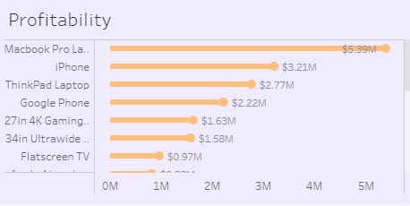

# Online-Store-Sales


##Overview
---

This Sales Analysis Project is aimed at comprehensively understanding and analyzing the sales data of Online Sales Store in order to derive actionable insights and make informed business decisions. By examining the sales patterns, trends, and key performance indicators, the project intends to identify potential opportunities for growth, as well as any areas that require improvement.

##Project Structure
---

•	Data/: Contains the raw dataset.

•	Scripts/: Includes SQL queries used for analysis.

•	reports/: Contains the generated reports and visualizations.

##Data Description
---

The dataset used for this analysis consists of the following columns:

- ‘Order Date’: The date and time when the order was made.

- ‘Order ID’: Unique identifier for each order.

- ‘Product’: Name of the product.

- ‘Product EAN’: Unique identifier for each product sold.

- ‘Category’: The category of the product sold.

- ‘State’: Unique identifier for each state.

- ‘Purchase Address’: The physical address of the buyer.

- ‘Quantity Ordered’: the number of items ordered per product.

- ‘Price Each’: The selling price of the product in dollars.

- ‘Cost price’: The cost price of the product in dollars.

- ‘Turnover’: The total price for the order of the product in dollars.

- ‘Margin’: The profit made per order.

##Tools
---

Excel - Data Cleaning.

PostgreSQL - Data Analysis.

Tableau - Data Visualization.

##Data cleaning and preparation
---

This process involved;

1. Data Loading and Inspection.

2. Removing blanks and duplicate orders from the dataset.

##Exploratory Data Analysis (EDA)
---

-Explored sales trends over time.

-Analyzed the distribution of sales across different product categories.

-Investigated the relationship between price and quantity sold.

-Identified top-selling products and customer segments.

##Data analysis
---

Includes some interesting codes used. For instance;

1. Using a derived column to get the actual total cost of goods sold as the cost price only represents on item.

```SQL
WITH T1 AS(
      SELECT product, (turnover - margin) AS cogs
      FROM sales)
SELECT SUM(cogs) as Cost_of_sales
FROM T1;
```

2. Using 'DATE_PART' function to show sales trend by 'month'.

```SQL

WITH T1 AS(
          SELECT DATE_PART('MONTH', order_date)AS month, SUM(turnover) AS Total_sales
          FROM sales
          GROUP BY 1)
SELECT month, SUM(Total_sales) AS Total_sales
FROM T1
GROUP BY 1
ORDER BY 1;
```

3. Creating a temporary table that uses 'LEFT', 'RIGHT'and 'POSITION' functions to extract the state abbreviation in the 'purchase address' column and then joining the temporary table to the 'sales' table to show the distribution of sales by state.

```SQL
WITH T1 AS(			
		SELECT purchase_address, right(purchase_address, 8) as p_a
		FROM sales),
	 T2 AS(
		SELECT purchase_address, LEFT(p_a, 2) as state
		FROM T1)

SELECT T2.state, SUM(S.Turnover) AS total_sales
FROM T2
JOIN sales s
ON s.purchase_address = T2.purchase_address
GROUP BY 1
ORDER BY 2 DESC;
```

##Data Visualization
---
For Interactive dashboard click [here.](https://public.tableau.com/app/profile/billy.ochieng/viz/OnlineStoreSalesDashboard_16989160843340/Dashboard1#1)

There is a steady increse in sales throughout the year with a spike in sales during the holiday season.
The store recorded total sales of $34,492063, December being the month with the highest sales.


Markbook Pro Laptop is the most profitable product at $5.39 Million with highest sales recorded during the holiday season.


AAA Bateries (4-pack) is the most sold product in every state with a total oders of upto 31,017.


California is the leading state in overall sales with total sale of $13.71 Million.
The store is currenntly operating in 8 States in the USA.


---

##Recommendation

For a deeper analysis, the dataset of the previous year will be required for comparison and data driven decision making.

---
